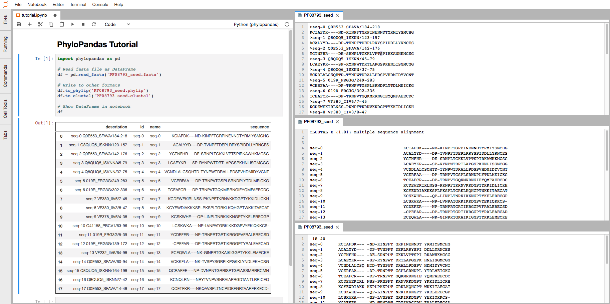
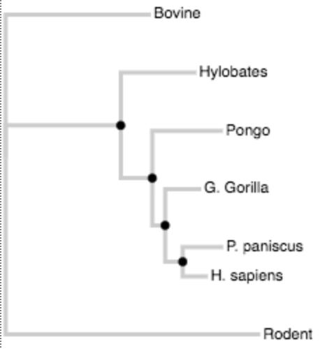

[](https://gitter.im/phylopandas/Lobby)
[](http://phylopandas.readthedocs.io/en/latest/?badge=latest)
[](https://travis-ci.org/Zsailer/phylopandas)

**Bringing the [Pandas](https://github.com/pandas-dev/pandas) `DataFrame` to phylogenetics.**


PhyloPandas provides a Pandas-like interface for reading sequence and phylogenetic tree data into pandas DataFrames. This enables easy manipulation of phylogenetic data using familiar Python/Pandas functions. Finally, phylogenetics for humans!



## How does it work?

Don't worry, we didn't reinvent the wheel. **PhyloPandas** is simply a [DataFrame](https://github.com/pandas-dev/pandas)
(great for human-accessible data storage) interface on top of [Biopython](https://github.com/biopython/biopython) (great for parsing/writing sequence data) and [DendroPy](https://github.com/jeetsukumaran/DendroPy) (great for reading tree data).

PhyloPandas does two things:
1. It offers new `read` functions to read sequence/tree data directly into a DataFrame.
2. It attaches a new `phylo` **accessor** to the Pandas DataFrame. This accessor provides writing methods for sequencing/tree data (powered by Biopython and dendropy).

## Basic Usage

**Sequence data:**

Read in a sequence file.
```python
import phylopandas as ph

df1 = ph.read_fasta('sequences.fasta')
df2 = ph.read_phylip('sequences.phy')
```

Write to various sequence file formats.

```python
df1.phylo.to_clustal('sequences.clustal')
```

Convert between formats.

```python
# Read a format.
df = ph.read_fasta('sequences.fasta')

# Write to a different format.
df.phylo.to_phylip('sequences.phy')
```

**Tree data:**

Read newick tree data
```python
df = ph.read_newick('tree.newick')
```

Plot newick data (using [phylovega]()).
```python
# Import PhyloVega.
from phylovega import VegaTree

# Initialize a Vega Tree object.
vt = VegaTree(df)

# Display the tree.
vt.display()
```



## Contributing

If you have ideas for the project, please share them on the project's [Gitter chat](https://gitter.im/phylopandas/Lobby).

It's *easy* to create new read/write functions and methods for PhyloPandas. If you
have a format you'd like to add, please submit PRs! There are many more formats
in Biopython that I haven't had the time to add myself, so please don't be afraid
to add them! I thank you ahead of time!

## Testing

PhyloPandas includes a small [pytest](https://docs.pytest.org/en/latest/) suite. Run these tests from base directory.
```
$ cd phylopandas
$ pytest
```

## Install

Install from PyPi:
```
pip install phylopandas
```

Install from source:

```
git clone https://github.com/Zsailer/phylopandas
cd phylopandas
pip install -e .
```

## Dependencies

- [BioPython](https://github.com/biopython/biopython): Library for managing and manipulating biological data.
- [DendroPy](https://github.com/jeetsukumaran/DendroPy): Library for phylogenetic scripting, simulation, data processing and manipulation
- [Pandas](https://github.com/pandas-dev/pandas): Flexible and powerful data analysis / manipulation library for Python
- [pandas_flavor](https://github.com/Zsailer/pandas_flavor): Flavor pandas objects with new accessors using pandas' new register API (with backwards compatibility).
